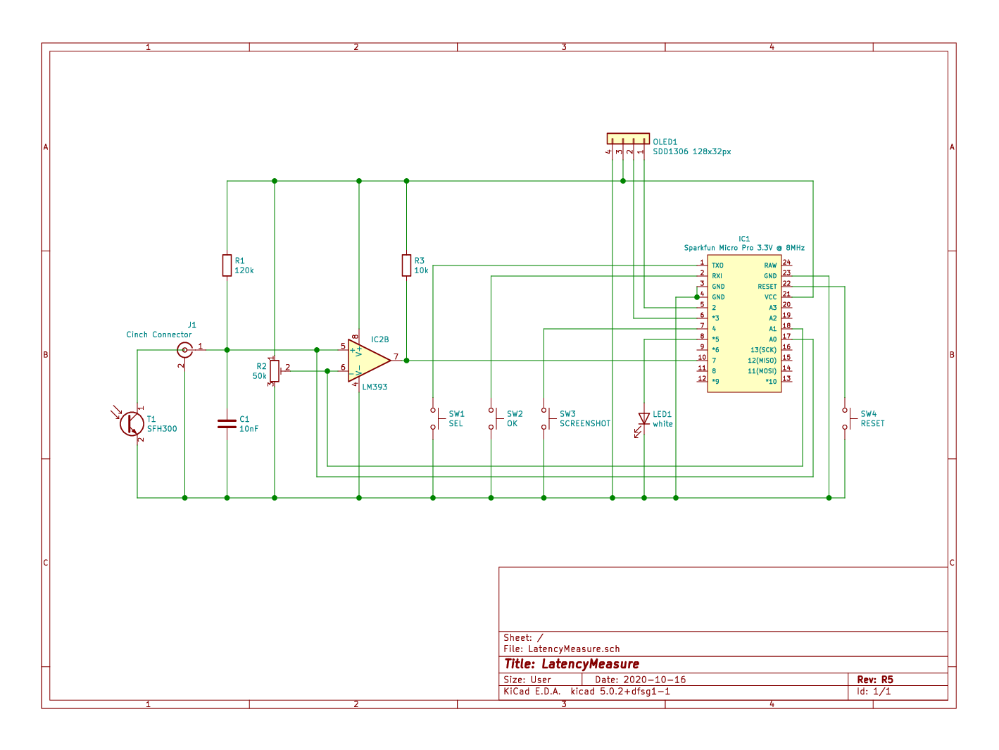
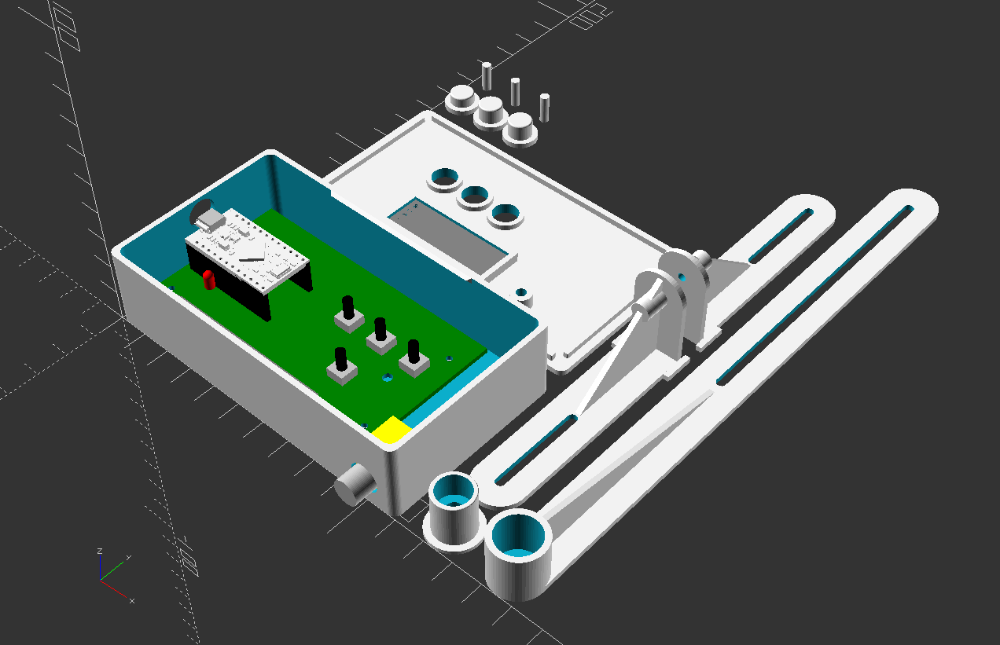

# LatencyMeasure
A tool to measure latency from keybard or mouse input to a visual response on the screen.

## Challenge

If an application is used in a setup where LAN or WAN segments, technologies like X11 forwarding, VNC, RDP or simply web are involved, the latency might ends up in a poor, user experience.
I needed a tool to measure these latencies from the human input to the visual response at the users screen.

## Solution

I have setup a small circuit with an Arduino compatible micro controller to simulate a HID (human input device) event via USB and registering the change on the screen via a photo transistor. The device will meassure and display the time between these events.
The micro controller is capable to deliver a resulotion of 1 ms.

## What is in this respository?

### [Circuit](Circuit/)

The circuit around the micro controller is documented here.
The circuit is designed with [KiCad](https://kicad-pcb.org/).
A PDF version is included.

The micro controller is a SparkFun Micro Pro 3.3V @ 8MHz. This controller is capable to work as a HID device (mouse or keyboard).

The photo transistor SFH300 (Note: don't use the infrared versions) is used as the sensor for the screen. The signal from the photo transistor and a reference voltage are the inputs for the used OpAmp LM393. These two inputs are also used as analog inputs, to allow the user an easy calibration of the sensor.

The three buttons are used for the navigation of the controllers application and are used as MODE, OK and RESET.

To test the timing of the circuit, the sensor is placed over the LED and the controllers timing test is started. This confirms the resulution and the processing speed of the device.

To display the main menu, the different pages like configuration, calibration as well as the measurment and its results, a small OLED is used with 128x32px (which is 4 rows 20 characters each).

### [LatencyMeasure](LatencyMeasure/)

This is the sketch for the micro controller. Use the [ArduinoIDE](https://www.arduino.cc/en/main/software) to compile and upload into the micro controller.

### [TestClient](TestClient/)

This directory includes different test client supporting different setups like
 - an [HTML web application](TestClient/HTML/) to be run in a web browser,

   
   
 - a [text-based application](TestClient/ncurses/) based on [NCURSES](https://invisible-island.net/ncurses/announce.html) written in C, and
 
   
   
 - a [graphical application](TestClient/Qt4/) based on [Qt](https://www.qt.io/) written in C++.
 
   

All test clients support the same functionality.

### [Case](Case/)

In this directory you will find a 3D model of an enclosure for the device, as well as a sensor mount to hang on the screen.
These models are designed with [OpenSCAD](https://www.openscad.org/). Use the latest version of OpenSCAD (nightly build).

### [Ressources](Ressources/)

This directory holds images and screenshots.
